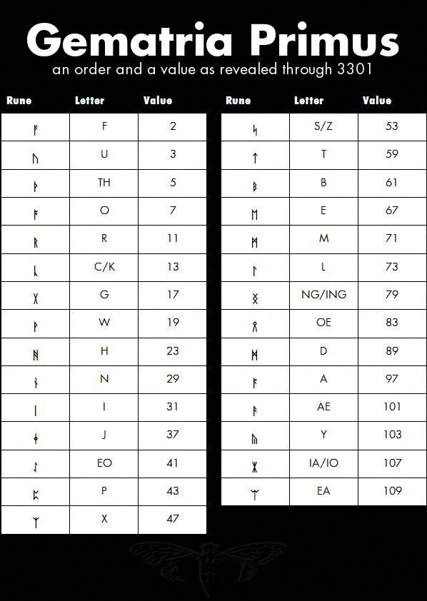

# Gematria Primus

???+ info "The Gematria Primus"
    | Rune  | Index | Prime | Plaintext |
    | :---: | :---: | :---: | :-------: |
    |   ᚠ   |   0   |   2   |     F     |
    |   ᚢ   |   1   |   3   |     U     |
    |   ᚦ   |   2   |   5   |  \[TH\]   |
    |   ᚩ   |   3   |   7   |     O     |
    |   ᚱ   |   4   |  11   |     R     |
    |   ᚳ   |   5   |  13   |     C     |
    |   ᚷ   |   6   |  17   |     G     |
    |   ᚹ   |   7   |  19   |     W     |
    |   ᚻ   |   8   |  23   |     H     |
    |   ᚾ   |   9   |  29   |     N     |
    |   ᛁ   |  10   |  31   |     I     |
    |   ᛄ   |  11   |  37   |     J     |
    |   ᛇ   |  12   |  41   |  \[EO\]   |
    |   ᛈ   |  13   |  43   |     P     |
    |   ᛉ   |  14   |  47   |     X     |
    |   ᛋ   |  15   |  53   |     S     |
    |   ᛏ   |  16   |  59   |     T     |
    |   ᛒ   |  17   |  61   |     B     |
    |   ᛖ   |  18   |  67   |     E     |
    |   ᛗ   |  19   |  71   |     M     |
    |   ᛚ   |  20   |  73   |     L     |
    |   ᛝ   |  21   |  79   |  \[NG\]   |
    |   ᛟ   |  22   |  83   |  \[OE\]   |
    |   ᛞ   |  23   |  89   |     D     |
    |   ᚪ   |  24   |  97   |     A     |
    |   ᚫ   |  25   |  101  |  \[AE\]   |
    |   ᚣ   |  26   |  103  |     Y     |
    |   ᛡ   |  27   |  107  |  \[IA\]   |
    |   ᛠ   |  28   |  109  |  \[EA\]   |

??? image "Alternatively, view in image form"
    
