# Part Two

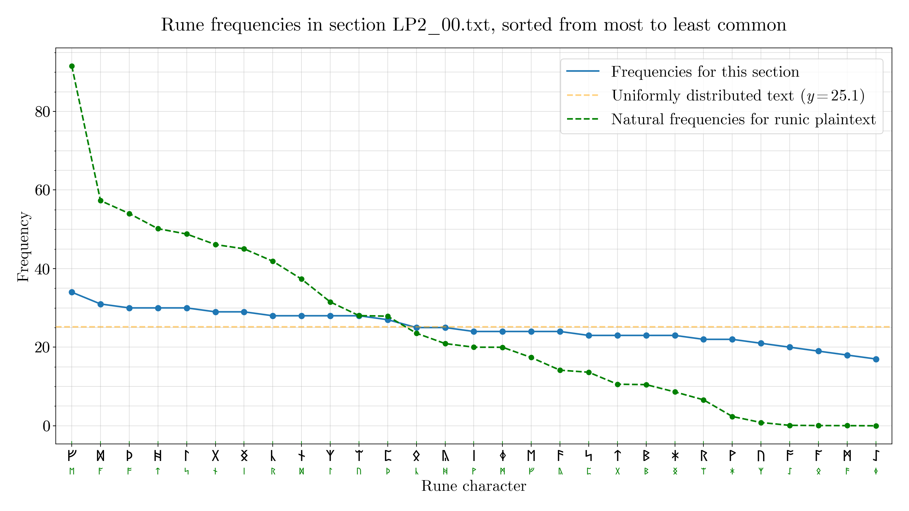{ width=450, loading=lazy }
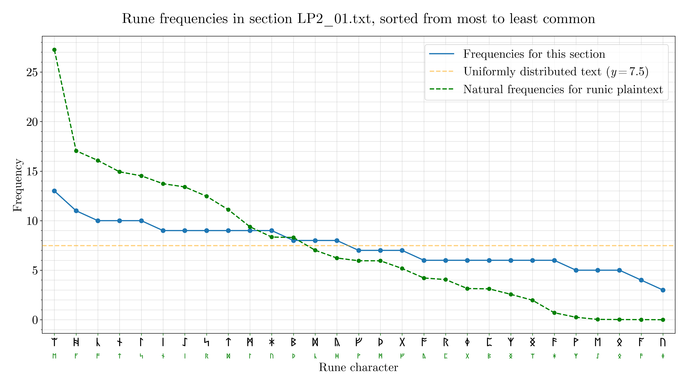{ width=450, loading=lazy }
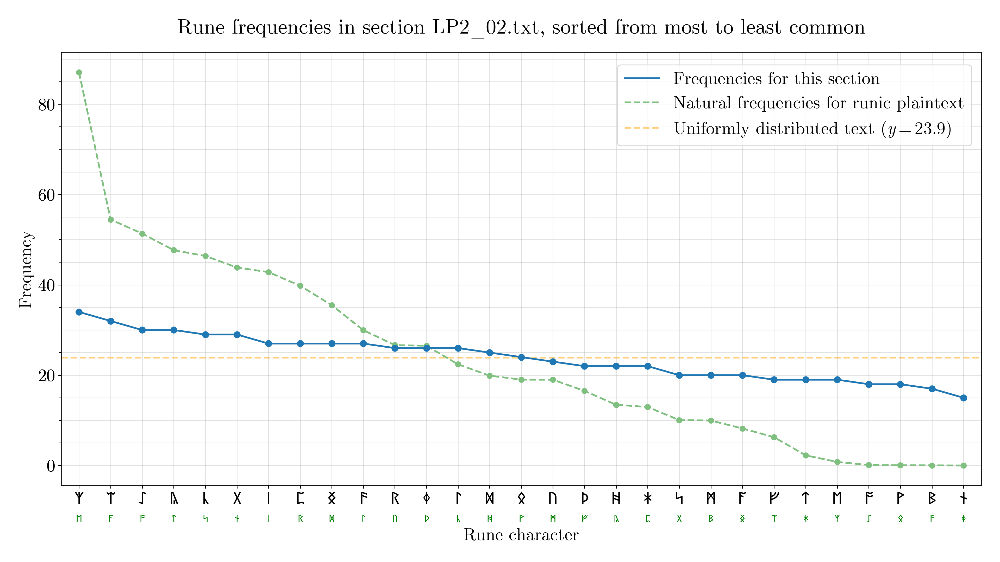{ width=450, loading=lazy }
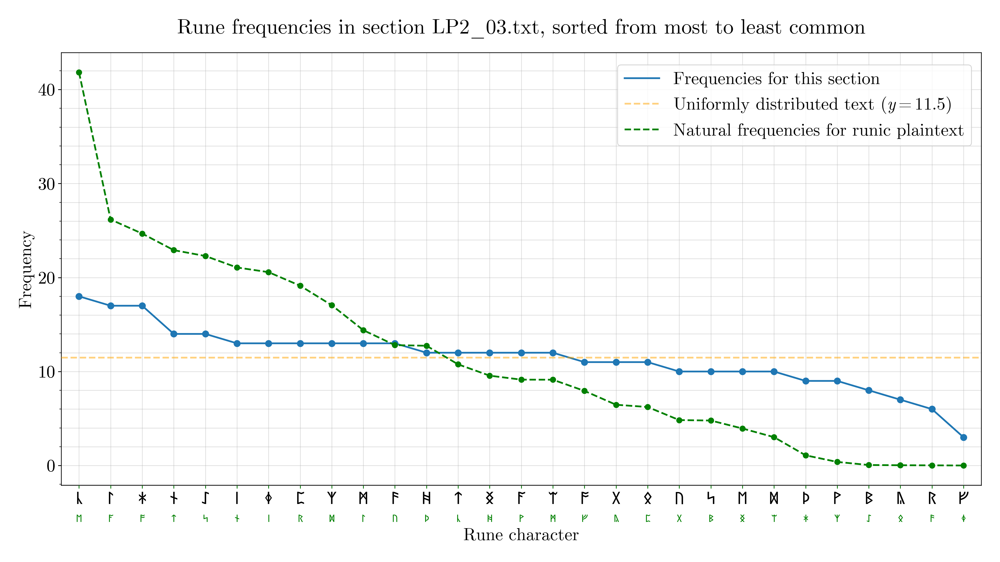{ width=450, loading=lazy }
{ width=450, loading=lazy }
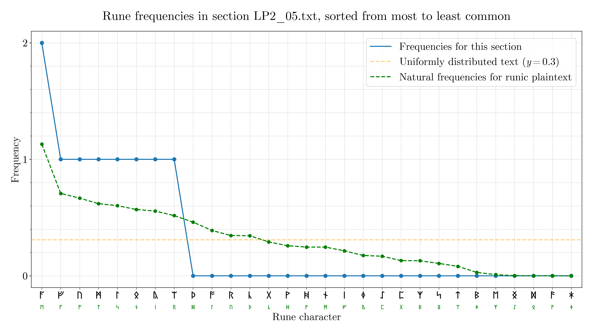{ width=450, loading=lazy }
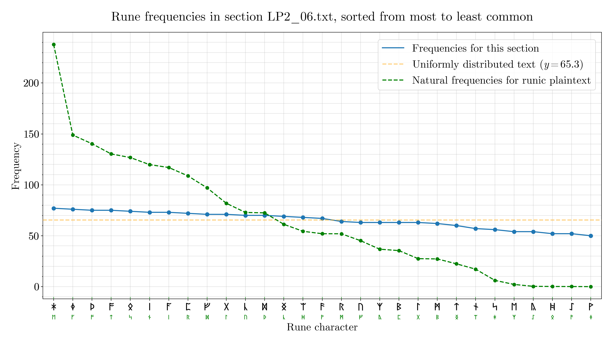{ width=450, loading=lazy }
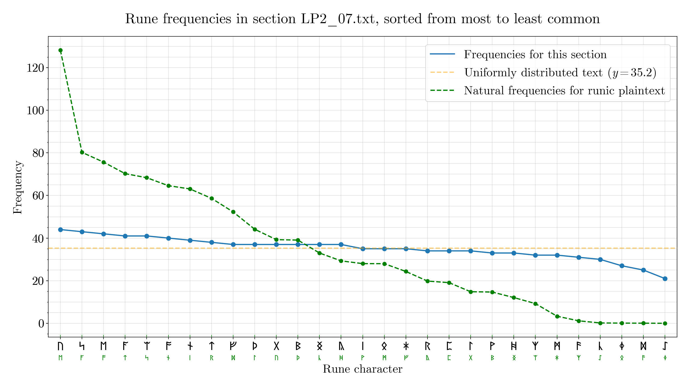{ width=450, loading=lazy }
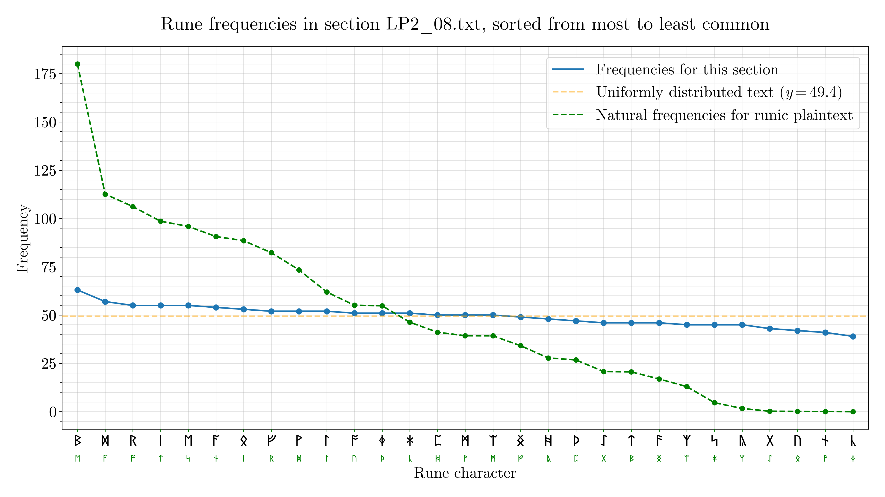{ width=450, loading=lazy }
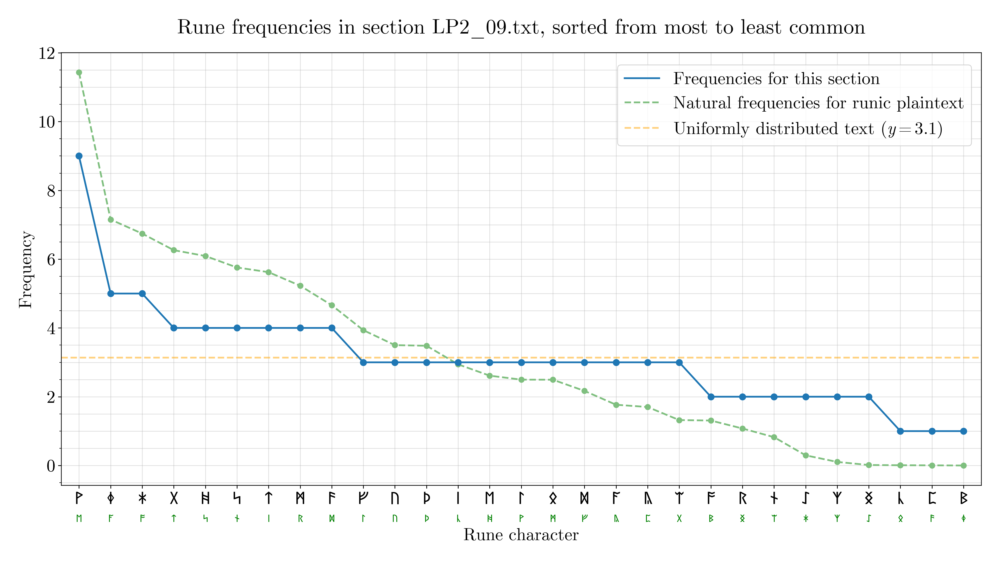{ width=450, loading=lazy }
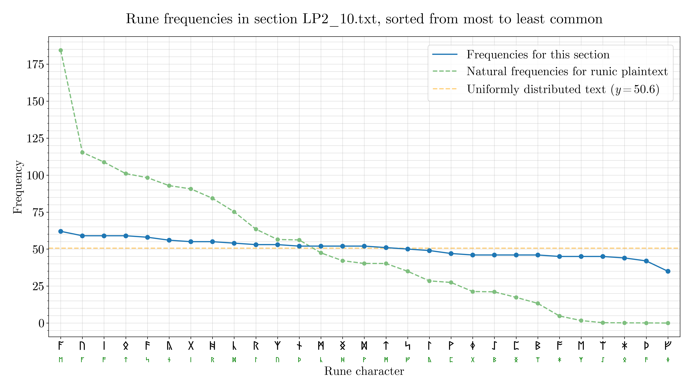{ width=450, loading=lazy }
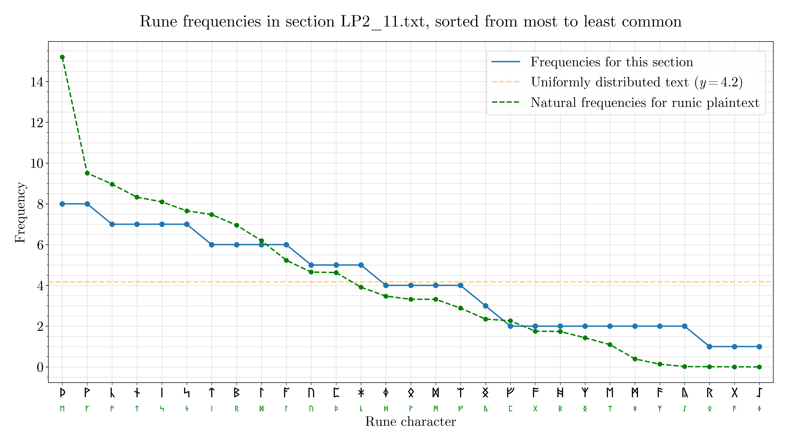{ width=450, loading=lazy }
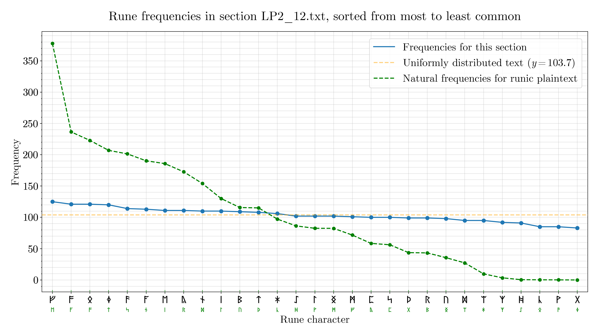{ width=450, loading=lazy }
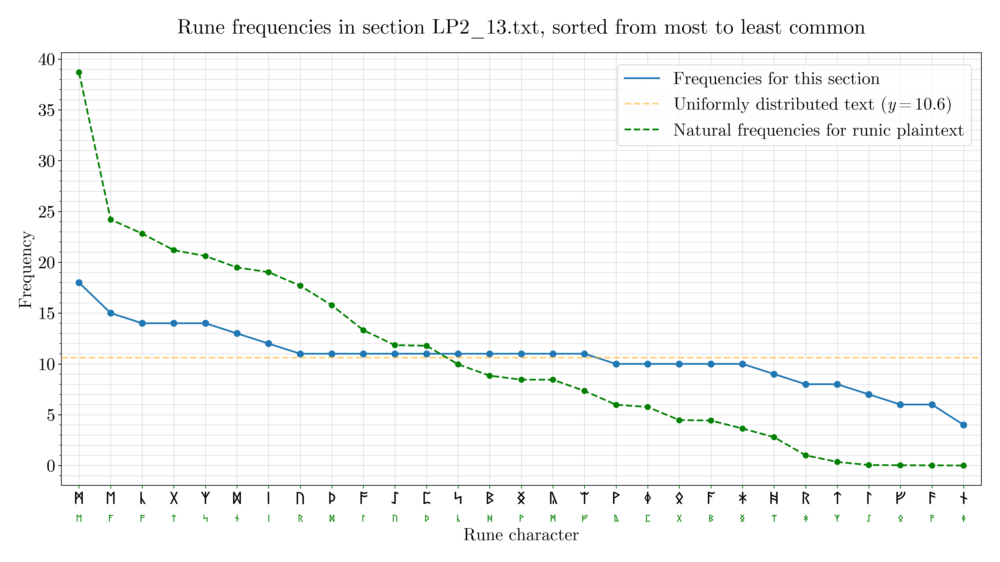{ width=450, loading=lazy }
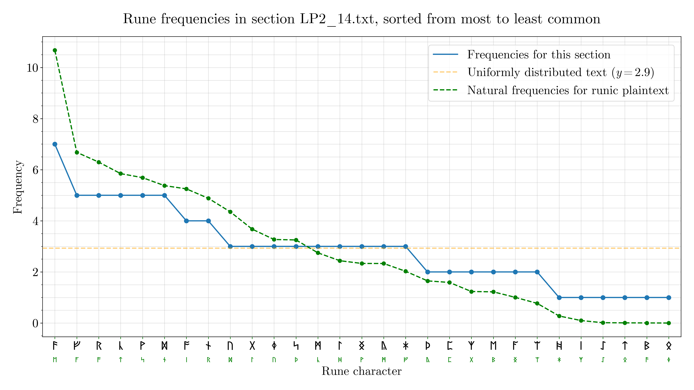{ width=450, loading=lazy }
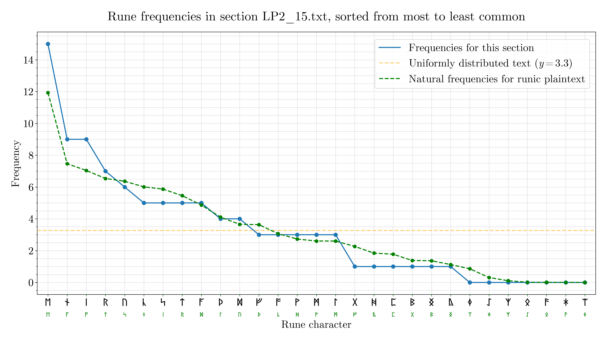{ width=450, loading=lazy }

The raw data can be found [here](./../../assets/images/LP/frequency-data/raw-data.json).
