# Part Two

{ loading=lazy, columns=2 }
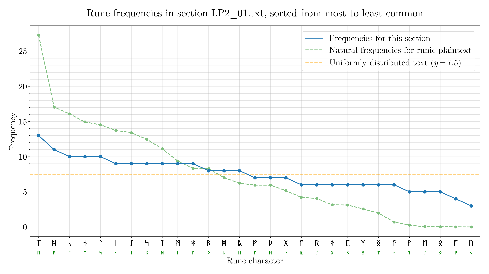{ loading=lazy }
{ loading=lazy }
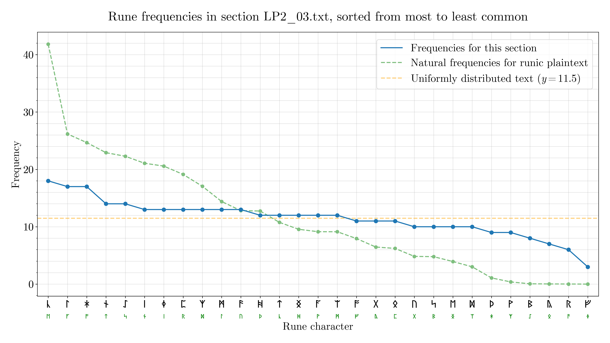{ loading=lazy }
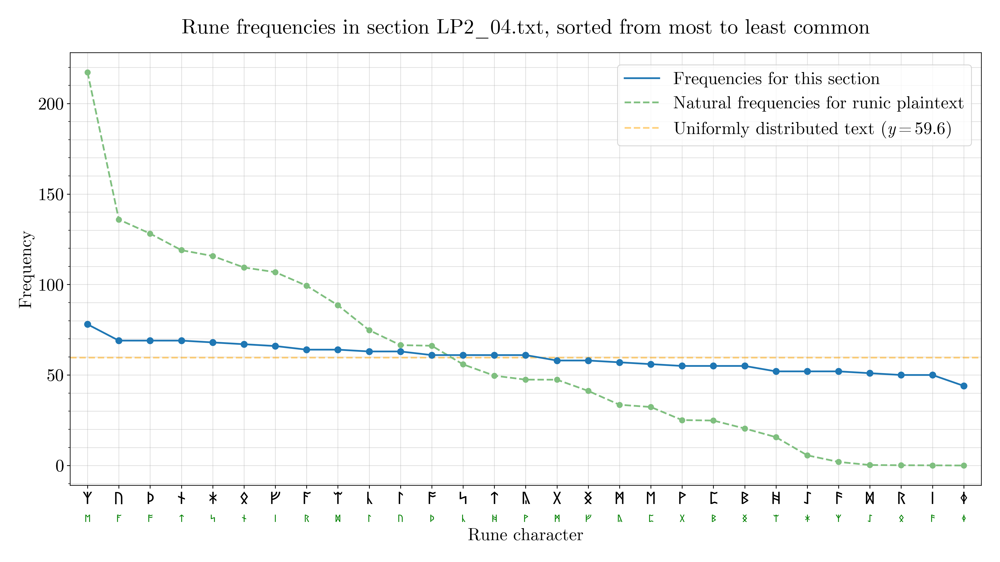{ loading=lazy }
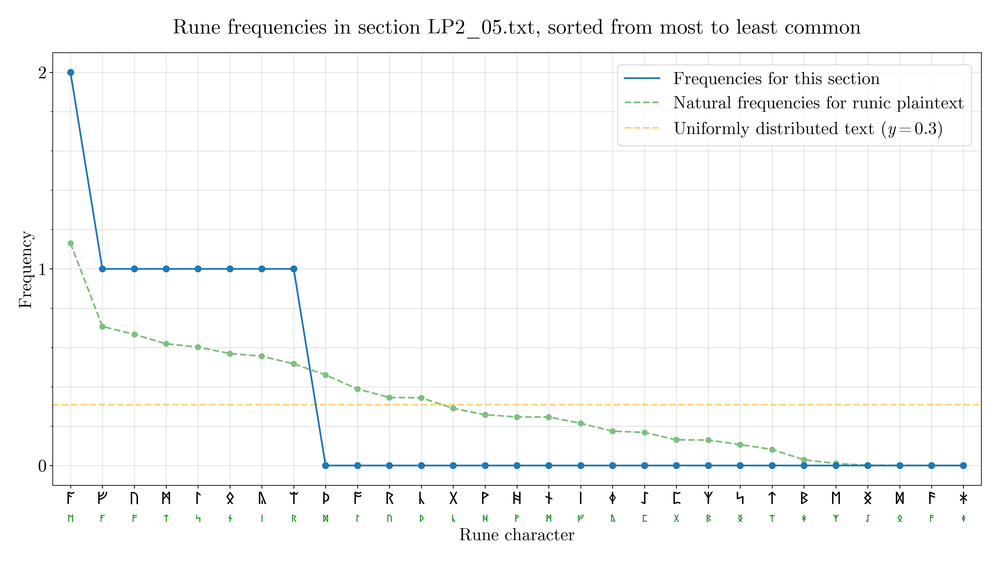{ loading=lazy }
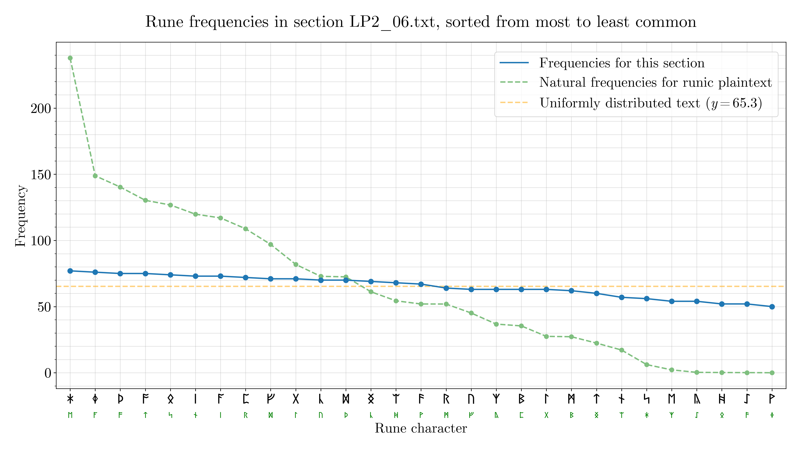{ loading=lazy }
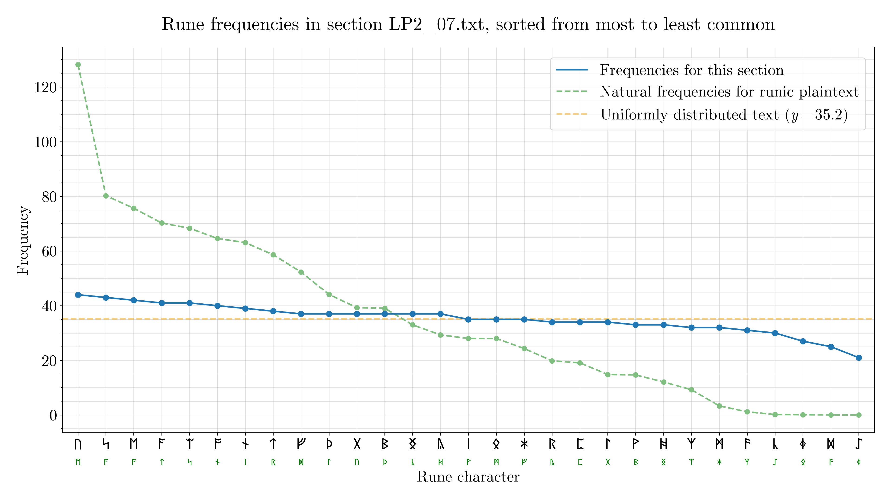{ loading=lazy }
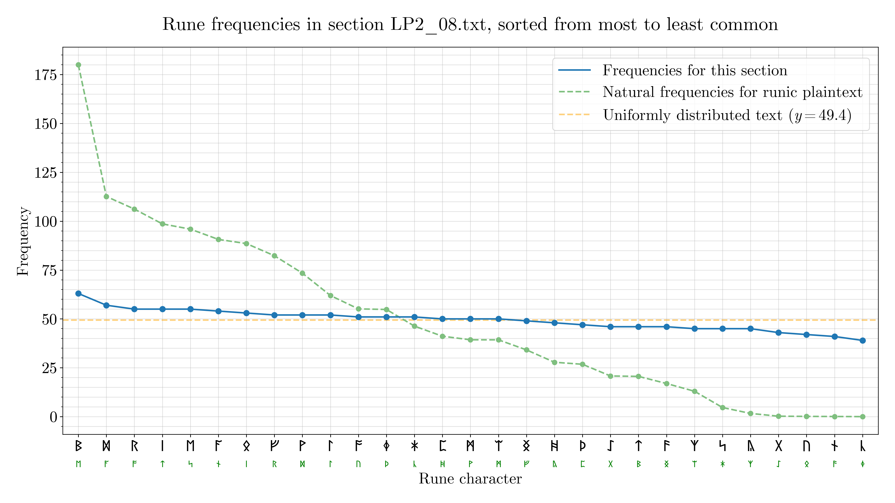{ loading=lazy }
{ loading=lazy }
{ loading=lazy }
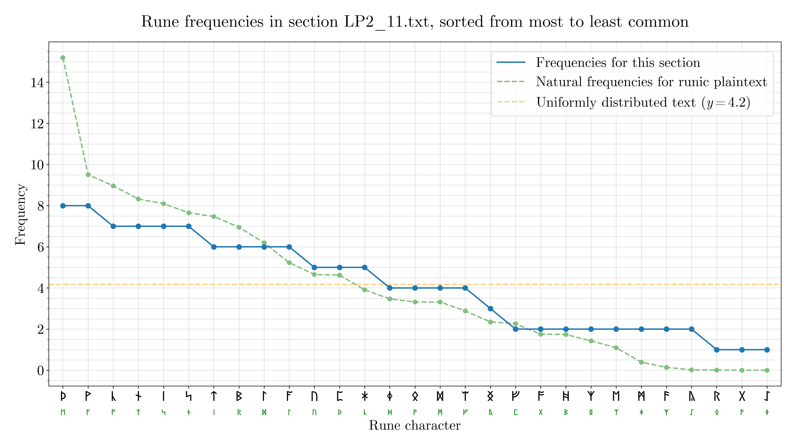{ loading=lazy }
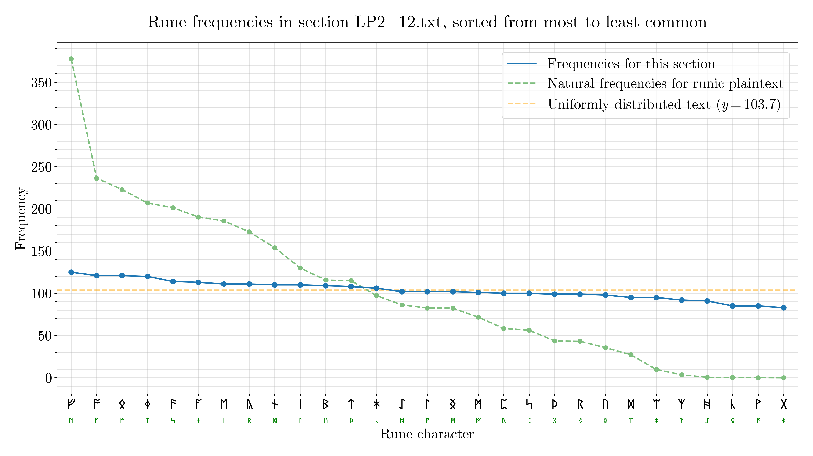{ loading=lazy }
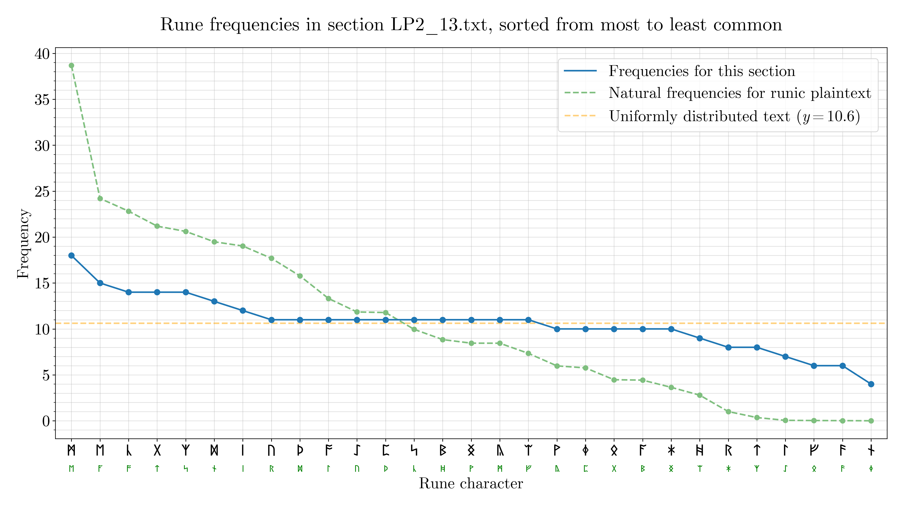{ loading=lazy }
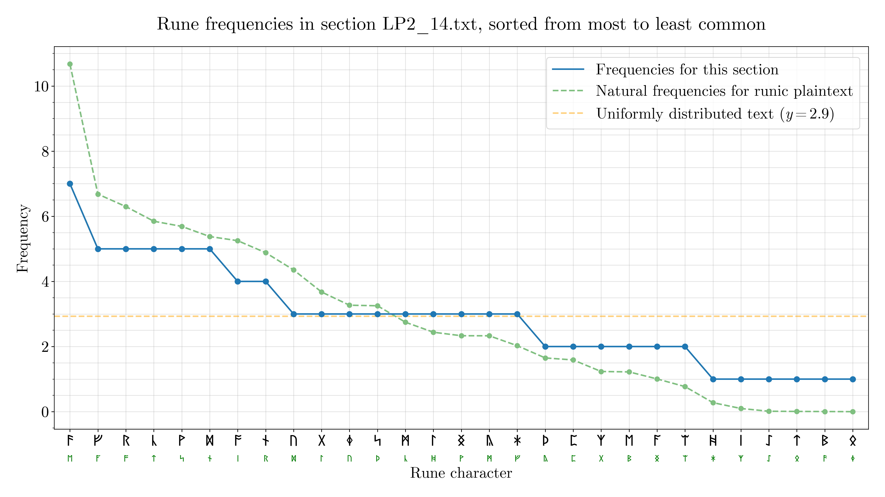{ loading=lazy }
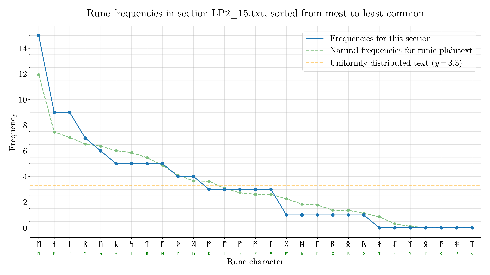{ loading=lazy }

The raw data can be found [here](./../../assets/images/LP/frequency-data/raw-data.json).

--8<-- "inclusions/abbreviations.md"
